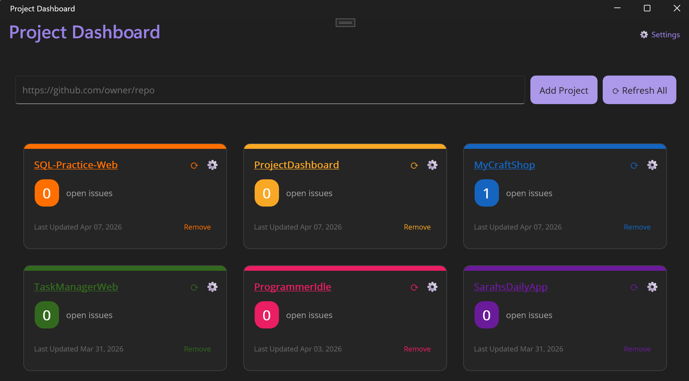

# Project Dashboard

A .NET MAUI desktop application (targeting Windows only currently) for monitoring your GitHub repositories at a glance. Track open issues, last updated dates, and quickly navigate to any of your projects — all from a single, organized dashboard.

## Features

- **Add GitHub Repositories** — Paste any GitHub repository URL to add it to your dashboard
- **Open Issue Count** — See the number of open issues for each project, displayed with a color-coded badge
- **Last Updated Date** — View when each repository was last updated
- **Refresh All** — Refresh data for all tracked repositories in one click
- **Per-Project Refresh** — Individually refresh any repository card
- **Remove Projects** — Remove a repository from the dashboard when it's no longer needed
- **Settings** — Configure application preferences
- **Colorful Project Cards** — Each repository card is assigned a unique accent color for easy visual identification
- **Clickable Repository Links** — Click a repository name to open it directly in your browser

## GitHub Token Setup

By default, the GitHub API allows **60 requests per hour** for unauthenticated requests. Adding a Personal Access Token (PAT) raises this limit to **5,000 requests per hour** and enables access to private repositories.

### Steps

1. Go to [github.com/settings/tokens](https://github.com/settings/tokens) and click **Generate new token**.
2. Give the token a descriptive name (e.g., `ProjectDashboard`).
3. Choose your token type and grant the required permissions (see table below).
4. Click **Generate token** and copy the value — it will only be shown once.
5. Open the app and click **Settings** (⚙️) in the top-right corner.
6. Paste your token into the **Personal Access Token** field and save.

> Your token is stored securely on your device using the platform credential store and is never transmitted anywhere other than the GitHub API.

### Required Permissions

#### Classic PAT (`github.com/settings/tokens` → Tokens classic)

| Scope | When you need it |
|---|---|
| *(no scopes)* | Public repositories only |
| **`repo`** | Read private repositories, issues, and commits |
| **`delete_repo`** | Delete repositories from within the app |

> Select the full **`repo`** scope — the sub-scopes (`public_repo`, `repo:status`, etc.) are **not** sufficient for private repo access on their own.

#### Fine-grained PAT (`github.com/settings/tokens` → Fine-grained tokens)

| Permission | Level | When you need it |
|---|---|---|
| **Metadata** | Read-only | Always required (repo info, rate limit) |
| **Contents** | Read-only | Read commits and file data |
| **Issues** | Read-only | Read open issue counts |
| **Administration** | Read and write | Delete repositories from within the app |

> Fine-grained PATs also require setting **Repository access** to *All repositories* (or selecting each private repo individually) — otherwise private repositories will not appear even with the correct permissions.

## Tech Stack

| Technology | Purpose |
|---|---|
| [.NET MAUI](https://learn.microsoft.com/dotnet/maui/) | Cross-platform UI framework |
| [.NET 10](https://dotnet.microsoft.com/) | Runtime & language platform |
| [CommunityToolkit.Mvvm](https://learn.microsoft.com/dotnet/communitytoolkit/mvvm/) | MVVM helpers, source generators, and commands |
| [SQLite (sqlite-net-pcl)](https://github.com/praeclarum/sqlite-net) | Local data persistence for saved projects |
| [GitHub REST API](https://docs.github.com/en/rest) | Repository data (issues, last updated, etc.) |

## Deployment
Currently there is no official deployment. Locally you can run `dotnet publish` and pin the .exe to the start menu
for easy access
